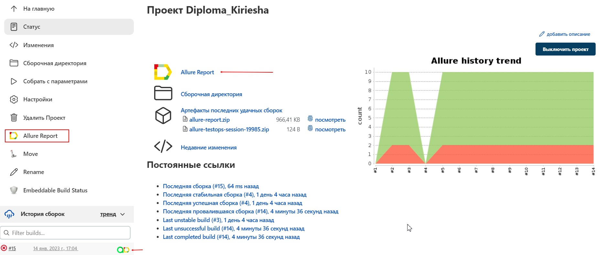

# Test automation project for [Litres](https://www.litres.ru/)

> LitRes is an international company that produces and distributes e-books and digital audiobooks.

# <a name="Description">Description</a>
+ [Technology stack](#Technology)
+ [tests](#Tests)
  + [AllureTestOps](#AllureTestOps)
+ [Gradle command](#GraleCommand)
+ [Jenkins](#Jenkins)
+ [Test results in Allure](#Allure)
+ [Jira integration](#Jira)
+ [Telegram notification](#Telegram)

# <a name="Technology">Technology stack</a>

[<code></code>](https://www.jetbrains.com/idea/) - development environment

[<code></code>](https://www.java.com/) - the programming language used to write the autotests

[<code></code>](https://github.com/) - a code hosting platform for version control and collaboration

[<code></code>](https://gradle.org/) - a self-assembly system

[<code></code>](https://ru.selenide.org/) - a framework for automated web application testing based on Selenium WebDriver
  
[<code></code>](https://aerokube.com/selenoid/latest/) - a Selenium testing platform running browsers and mobile platforms in Docker containers
  
[<code></code>](https://junit.org/junit5/)  - a framework for unit testing.

[<code></code>](https://qameta.io/allure-report/) - a flexible, lightweight multi-language test reporting tool
  
[<code></code>](https://qameta.io/) - Next-gen Software Quality Management Platform for manual and automation testing

[<code></code>](https://www.jenkins.io/) - a system that ensures a process of continuous software integration

[<code></code>](https://www.atlassian.com/ru/software/jira) - a system for task tracking and project management

[<code></code>](https://web.telegram.org/z/) - a cloud-based mobile and desktop messaging app with a focus on security and speed.

[To Description](#Description)

# <a name="tests">Tests</a>
 > - Test " Lower-Menu-Module Selection ";
 > - Test "Genres menu";
 > - Test "Scrolling the carousel on the Main page";
 > - Test books title search;
 > - Checking the addition of books to favourites;
 > - User credentials validation:
 >   - Valid Autorisation;
 >   - Invalid Autorisation;

## <a name="AllureTestOps">AllureTestOps</a> 

[To Description](#Description)

# <a name="GradleCommand">Gradle Command</a>
To run the test locally from the terminal, run the command:
>**gradle clean test**

Parameterised assembly:
>**gradle clean test -DbaseUrl=${BASEURL} -Dbrowser=${BROWSER} -DbrowserVersion=${BROWSER_VERSION} -DEnvironment=${ENVIRONMENT} -DbrowserSize=${BROWSER_SIZE} -DremoteDriverUrl=${SELENOID_URL}**

[To Description](#Description)

# <a name="Jenkins">Jenkins</a>
>1. To start the build, you need to enter the parameters in the settings and then build with the specified parameters:

[<code></code>](https://jenkins.autotests.cloud/job/Diploma_Kiriesha/)

>2. Selecting parameters for assembly:

[<code></code>](https://jenkins.autotests.cloud/job/Diploma_Kiriesha/)
>3. After assembly, you can watch the Allure report:

<code></code>
[To Description](#Description)

# <a name="Allure">Test results in Allure</a>
>1. On the Overview tab you can see general information:

[<code></code>](https://jenkins.autotests.cloud/job/Diploma_Kiriesha/2/allure/)
>2. This tab contains graphs:

[<code></code>](https://jenkins.autotests.cloud/job/Diploma_Kiriesha/2/allure/#graph)
> 3. On this tab you can view the test steps and Attachments for each test:

[<code></code>](https://jenkins.autotests.cloud/job/Diploma_Kiriesha/2/allure/#suites)

[To Description](#Description)

# <a name="Jira">Jira integration</a>

[To Description](#Description)

# <a name="Telegram">Telegram notification</a>

<code></code>

[To Description](#Description)

